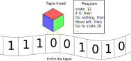
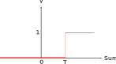

# The McCulloch-Pitts Artificial Neuron

## History and definition

Alan Turing's formalization of computation as [Turing Machines](https://www.youtube.com/watch?v=dNRDvLACg5Q) provided the theoretical and mathematical foundations for modern computer science[<sup>1</sup>](#fn1). Turing Machines are an abstraction of a general computation device. Turing (1937) described these machines as composed by an "infinite tape" made of "cells" (divided into squares), a "tape head", and a table with a finite set of instructions. Each cell contained a symbol, either a 0 or a 1, serving as information storage. The tape head can move along the tape, one cell at the time, to read the cell information. Then, according to a table of instructions at that state and the cell information, the tape head can erase information, write information, or do nothing, to then move to the next cell at the left or the right. In the next cell, the tape head would again do something according to the table of instructions and the cell information, to then repeat the process until the last instruction in the table of instructions. Figure 1 shows a representation of a Turing machine.

<center>Figure 1<center/>
<br style = “line-height:100px;”>


The particularities of Turing's description of Turing Machines are not relevant. You can envision a different way to implement the same general computing device. Indeed, alternative models of computation exist, such as "lambda calculus" and "cellular automata" (Fernández, 2009). The crucial part of Turing's proposal was the articulation of a machine capable to implement *any computable program*. The *computable* part of the last phrase is important because as Turing demonstrated, there are functions that can not be computed, like the [*Entscheidungsproblem*](https://en.wikipedia.org/wiki/Entscheidungsproblem) (a famous problem in mathematics formulated by [David Hilbert](https://en.wikipedia.org/wiki/David_Hilbert) in 1928), one of the problems that motivated Turing's work in the first place. 

The advances in computability theory inspired a new generation of researchers to develop computational models in the study of cognition. Among the pioneers were [Warren McCulloch](https://en.wikipedia.org/wiki/Warren_McCulloch) and [Walter Pitts](https://en.wikipedia.org/wiki/Walter_Pitts), who in 1943 proposed that biological neurons can be described as computational devices. In a way, this is another iteration to the problem of describing a general-purpose computation device. This time, inspired by how biological neurons work, and with an architecture significantly different than Turing Machines.  

The heart of the McCulloch and Pitts idea is that given the *all-or-none* character of neural activity, the behavior of the nervous system can be described by means of *propositional logic*. To understand this, let's examine that main components of biological neurons:
1. the **cell body** containing the nucleus and metabolic machinery
2. an **axon** that transmit information via its synaptic terminals, and 
1. the **dendrites** that receive inputs from other neurons via synapses. 

**Figure 2** shows an abstract scheme of the main components of two neurons and their synapses.

<span id="fn1"> *Footnote* 1: a detalied examination of the Turin Machine is beyond the scope of this tutorial. For an extended explanation of Turing Machines see https://plato.stanford.edu/entries/turing-machine/#DefiTuriMach </span>

<center>Figure 2<center/>
<br style = “line-height:100px;”>


Neurons communicate with each other by passing *electro-chemical signals* from the axon terminals in the pre-synaptic neuron to the dendrites in the post-synaptic neuron. Usually, each neuron connects to hundreds or thousands of neurons. For a neuron to "*fire*", certain voltage *threshold* must be passed. The *combined excitatory and inhibitory input* received by the post-synaptic neuron from the pre-synaptic neurons determines whether the neuron passes the threshold and fires. Is this *firing* or *spiking* behavior that McCulloch and Pitts modeled computationally. Furthermore, by carefully calibrating the combination of inhibitory and excitatory signals passed to a neuron, McCulloch and Pitts were able to emulate the behavior of a few *boolean functions* or *logical gates*, like the *AND* gate and the *OR* gate. Thinking in this process abstractly, neurons can be seen as biological computational devices, in the sense that they can receive inputs, apply calculations over those inputs algorithmically, and then produce outputs.

The main elements of the McCulloch-Pitts model can be summarized as follow:
1. Neuron activation is binary. A neuron either fire or not-fire
2. For a neuron to fire, the weighted sum of inputs has to be equal or larger than a predefined threshold
3. If one or more inputs are inhibitory the neuron will not fire
4. It takes a fixed one time step for the signal to pass through a link 
5. Neither the structure nor the weights change over time

McCulloch and Pitts decided on this architecture based on what it was known at the time about the function of biological neurons. Naturally, they also wanted to abstract away most details and keep what they thought were the *fundamentals elements* to represent computation in biological neurons. Next, we will examine the formal definition of this model.

## Mathematical Definition

McCulloch and Pitts developed a mathematical formulation know as *linear threshold gate*, which describes the activity of a single neuron with two states, *firing* or *not-firing*. In its simplest form, the mathematical formulation is as follows:

$$
Sum = \sum_{i=1}^NI_iW_i
$$

$$
y(Sum)=
\begin{cases}
1, & \text{if } Sum \geq T \\
0, & \text{otherwise}
\end{cases}
$$

Where  $I_1, I_2,..., I_N$ are binary input values  $\in\{0,1\}$ ;  $W_1, W_2,..., W_N$ are weights associated with each input $\in\{-1,1\}$ ; $Sum$ is the weighted sum of inputs; and $T$ is a predefined threshold value for the neuron activation (i.e., *firing*). **Figure 3** shows a graphical representation of the McCulloch-Pitts artificial neuron.

<center>Figure 3<center/>
<br style = “line-height:100px;”>


An input is considered *excitatory* when its contribution to the weighted sum is positive, for instance $I_1*W_1 = 1 * 1 = 1$; whereas an input is considered *inhibitory* when its contribution to the weighted sum is negative, for instance $I_1*W_1 = 1 * -1 = -1$. If the value of $Sum$ is $\geq$ $T$, the neuron fires, otherwise, it does not. **Figure 4** shows a graphical representation of the threshold function.

<center>Figure 4</center>
<br style = “line-height:100px;”>
<center></center>

This is known as a *step-function*, where the $y$-axis encodes the activation-state of the neuron, and the $Sum$-axis encodes the output of the weighted sum of inputs.

**Note**: It is important to highlight that the only role of the "weights" in the McCulloch-Pitts model, as presented here, is to determine whether the input is excitatory or inhibitory. If you are familiar with modern neural networks, this is a different role. In modern neural networks, weights have the additional role of *increasing* and *decreasing* the input values. From that perspective, the McCulloch-Pitts model is actually *unweighted*.

## Code implementation

Implementing the McCulloch-Pitts artificial neuron in code is very simple thanks to the features offered by libraries of high-level programming languages that are available today. We can do this in four steps using `python` and `numpy`: 

### Step 1: generate a vector of inputs and a vector of weights


```python
import numpy as np
np.random.seed(seed=0)
I = np.random.choice([0,1], 3)# generate random vector I, sampling from {0,1}
W = np.random.choice([-1,1], 3) # generate random vector W, sampling from {-1,1} 
print(f'Input vector:{I}, Weight vector:{W}')
```

    Input vector:[0 1 1], Weight vector:[-1  1  1]


### Step 2: compute the dot product between the vector of inputs and weights


```python
dot = I @ W
print(f'Dot product: {dot}')
```

    Dot product: 2


### Step 3: define the threshold activation function


```python
def linear_threshold_gate(dot: int, T: float) -> int:
    '''Returns the binary threshold output'''
    if dot >= T:
        return 1
    else:
        return 0
```

### Step 4: compute the output based on the threshold value


```python
T = 1
activation = linear_threshold_gate(dot, T)
print(f'Activation: {activation}')
```

    Activation: 1


In the previous example, the threshold was set to $T=1$. Since $Sum=2$, the neuron fires. If we increase the threshold for firing to  $T=3$, the neuron will not fire.


```python
T = 3
activation = linear_threshold_gate(dot, T)
print(f'Activation: {activation}')
```

    Activation: 0


## Application: boolean algebra using the MccCulloch-Pitts artificial neuron

Understanding how logical thinking works has been one of the main goals of cognitive scientists since the creation of the field. One way to approach the study of logical thinking is by building an artificial system able to perform logical operations. [*Truth tables*](https://en.wikipedia.org/wiki/Truth_table) are a schematic way to express the behavior of *boolean functions*, which are essentially logical operations. Here, we will use the McCulloch-Pitts model to replicate the behavior of a few boolean functions, as expressed in their respective truth tables. Notice that I'm using the term "function" to describe boolean logic, but you may find that the term "logic gate" is also widely used, particularly in the electronic circuits literature where this kind of function is fundamental.

### The AND Function

The *AND* function is "activated" only when all the incoming inputs are "on", this is, it outputs a 1 only when all inputs are 1. In "neural" terms, the neuron *fires* when all the incoming signals are *excitatory*. On a more abstract level, think in a situation where you would decide that something is "true" or you would say "yes", depending on the value of some "conditions" or "variables". This relationship is expressed in **Table 1**. 

<center>Table 1: Truth Table For AND Function</center>

| A | B | Output |
|---|---|--------|
| 0 | 0 | 0      |
| 0 | 1 | 0      |
| 1 | 0 | 0      |
| 1 | 1 | 1      |

Now, imagine that you are deciding whether to watch a movie or not. In this simplified scenario, you would watch the movie *only if* the movie features Samuel L. Jackson AND the director is Quentin Tarantino. Now the truth table looks like this:

<center>Table 2: Movie Decision Table</center>

| Samuel L. Jackson | Quentin Tarantino | Watch the movie |
|-------------------|-------------------|-----------------|
| No                | No                | No              |
| No                | Yes               | No              |
| Yes               | No                | No              |
| Yes               | Yes               | Yes             |

As we mentioned, the AND function can be implemented with the McCulloch-Pitts model. Each neuron has four parts: *inputs*, *weights*, *threshold*, and *output*. The *inputs* are given in the **Movie Decision Table**, and the *output* is completely determined by other elements, therefore, to create an AND function, we need to manipulate the *weights* and the *threshold*. Since we want the neuron to fire only when both inputs are excitatory, the threshold for activation must be 2. To obtain an output of 2, we need both inputs to be excitatory, therefore, the weights must be positive (i.e., 1). Summarizing, we need: 

- weights: all positive
- threshold: 2

Now, let's repeat the same four steps.

#### Step 1: generate a vector of inputs and a vector of weights


```python
# matrix of inputs
input_table = np.array([
    [0,0], # both no
    [0,1], # one no, one yes
    [1,0], # one yes, one no
    [1,1]  # bot yes
])

print(f'input table:\n{input_table}')
```

    input table:
    [[0 0]
     [0 1]
     [1 0]
     [1 1]]


```python
# array of weights
weights = np.array([1,1])
print(f'weights: {weights}')
```

    weights: [1 1]


#### Step 2: compute the dot product between the matrix of inputs and weights


```python
# dot product matrix of inputs and weights
dot_products = input_table @ weights
print(f'Dot products: {dot_products}')
```

    Dot products: [0 1 1 2]


**Note**: in case you are wondering why multiplying a 4x2 matrix by a 1x2 vector works, the answer is that `numpy` internally "broadcast" the smaller array to match the shape of the larger array. This means that the 1x2 is transformed into a 4x2 array where each new row replicates the values of the original 1x2 array. More on broadcasting [here](https://numpy.org/doc/1.18/user/basics.broadcasting.html).

#### Step 3: define the threshold activation function

We defined this already, so we will reuse our `linear_threshold_gate` function

#### Step 4: compute the output based on the threshold value


```python
T = 2
for i in range(0,4):
    activation = linear_threshold_gate(dot_products[i], T)
    print(f'Activation: {activation}')
```

    Activation: 0
    Activation: 0
    Activation: 0
    Activation: 1


As expected, only the last movie, with Samuel L. Jackson as an actor and Quentin Tarantino as director, resulted in the neuron firing.

### The OR Function

The *OR* function is "activated" when *at least one* of the incoming inputs is "on". In "neural" terms, the neuron *fires* when at least one of the incoming signals is *excitatory*. This relationship is expressed in **Table 3**.

<center>Table 3: Truth Table For OR Function</center>

| A | B | Output |
|---|---|--------|
| 0 | 0 | 0      |
| 0 | 1 | 1      |
| 1 | 0 | 1      |
| 1 | 1 | 1      |

Imagine that you decide to be flexible about your decision criteria. Now, you will watch the movie *if at least one* of your favorite stars, Samuel L. Jackson or Quentin Tarantino, is involved in the movie. Now, the truth table looks like this:

<center>Table 4: Movie Decision Table</center>

| Samuel L. Jackson | Quentin Tarantino | Watch the movie |
|-------------------|-------------------|-----------------|
| No                | No                | No              |
| No                | Yes               | Yes             |
| Yes               | No                | Yes             |
| Yes               | Yes               | Yes             |

Since we want the neuron to fire when at least one of the inputs is excitatory, the threshold for activation must be 1. To obtain an output of at least 1, we need both inputs to be excitatory, therefore, the weights must be positive (i.e., 1). Summarizing, we need: 

- weights: all positive
- threshold: 1

Now, let's repeat the same four steps.

#### Step 1: generate a vector of inputs and a vector of weights

Neither the matrix of inputs nor the array of weights changes, so we can reuse our `input_table` and `weights` vector.

#### Step 2: compute the dot product between the matrix of inputs and weights

Since neither the matrix of inputs nor the vector of weights changes, the dot product of those stays the same.

#### Step 3: define the threshold activation function

We can use the `linear_threshold_gate` function again.

#### Step 4: compute the output based on the threshold value


```python
T = 1
for i in range(0,4):
    activation = linear_threshold_gate(dot_products[i], T)
    print(f'Activation: {activation}')
```

    Activation: 0
    Activation: 1
    Activation: 1
    Activation: 1


As you can probably appreciate by now, the only thing we needed to change was the `threshold` value, and the expected behavior is obtained.

### The NOR function

The *OR* function is "activated" when *all* the incoming inputs are "off". In this sense, it is the inverse of the OR function. In "neural" terms, the neuron *fires* when all the signals are *inhibitory*. This relationship is expressed in **Table 5**. 

<center>Table 5: Truth Table For OR Function</center>

| A | B | Output |
|---|---|--------|
| 0 | 0 | 1      |
| 0 | 1 | 0      |
| 1 | 0 | 0      |
| 1 | 1 | 0      |

This time, imagine that you got saturated of watching Samuel L. Jackson and/or Quentin Tarantino movies, and you decide you only watch movies where both are absent. The presence of even one of them is unacceptable for you. The new truth table looks like this:

<center>Table 6: Movie Decision Table</center>

| Samuel L. Jackson | Quentin Tarantino | Watch the movie |
|-------------------|-------------------|-----------------|
| No                | No                | Yes             |
| No                | Yes               | No              |
| Yes               | No                | No              |
| Yes               | Yes               | No              |

Since we want the neuron to fire only when both inputs are inhibitory, the threshold for activation must be 0. To obtain an output of 0, we need both inputs to be inhibitory, therefore, the weights must be negative (i.e., -1). Summarizing, we need: 

- weights: all negative
- threshold: 0

Now, let's repeat the steps.

#### Step 1: generate a vector of inputs and a vector of weights

The matrix of inputs remain the same, but we need a new vector of weights


```python
# array of weights
weights = np.array([-1,-1])
print(f'weights: {weights}')
```

    weights: [-1 -1]


#### Step 2: compute the dot product between the matrix of inputs and weights


```python
# dot product matrix of inputs and weights
dot_products = input_table @ weights
print(f'Dot products: {dot_products}')
```

    Dot products: [ 0 -1 -1 -2]


#### Step 3: define the threshold activation function

The function remains the same.

#### Step 4: compute the output based on the threshold value


```python
T = 0
for i in range(0,4):
    activation = linear_threshold_gate(dot_products[i], T)
    print(f'Activation: {activation}')
```

    Activation: 1
    Activation: 0
    Activation: 0
    Activation: 0


One more time, we obtain the expected behavior: when both, Jackson and Tarantino are absent, the neuron fires.

## Limitations of the McCulloch-Pitts Artificial Neuron

Many other boolean functions can be emulated with this simple, yet versatile model. Nonetheless, it has many limitations. Among the main ones are:
- **Only binary inputs and outputs are allowed**: this is a significant limitation since many of the features that you can imagine can be useful to make decisions are *continuous* rather than binary. The same goes for the decisions themselves, where in many instances you may want to attach a continuous value (e.g., a probability value) to a decision instead of a yes or no label.
- **No learning is possible**: as you may have realized, you have to figure it out the solution to your problem *beforehand*. In this sense, the model has no autonomy whatsoever, restricting the problems that can be solved to the ones that you know how to solve already. 
- **Manual adjustment of the weights and threshold**: connected to the lack of a learning procedure, once you figure out the solution, you will have to adjust all the parameters by hand. 

## Conclusions

The McCulloch-Pitts artificial neuron was a significant first step in the development of artificial neural network models of cognition. Interestingly, it lacks two elements that are at the core of modern artificial neural networks: (1) it works with binary inputs and outputs, instead of arbitrary real-valued numbers, and (2) it does not incorporate a learning algorithm, which limits its functionality to problems that can be derived by the modeler. That being said, this model was a remarkable creative achievement to the extent that blended insights from theoretical computer science, logic, neuroscience, and cognitive psychology.

An important remaining question is to what extent the McCulloch-Pitts artificial neurons says something substantial about human cognition. Although is true that this model was able to perform logical inference as humans do, it is not clear that the procedure is indeed similar to what is going on in the human mind. Part of the credibility of this approach comes from the fact that it is based on the observed behavior of biological neurons. If you come from the perspective that cognition is whatever the brain is doing, you have a starting point to validate this model. Now, binary threshold functions are an extremely simplified model of what brains do. Is this a good enough model of neurocognitive function? Probably not. As we know today, the behavior of ensembles of neurons is incredibly complex, to the point that it is hard to even conceive a complete model of brain function. That being said, it would be unfair to judge this model against such standards. As we mentioned in the introduction, computational models of cognition do not pretend to be a replica of the mind. From that perspective, it is undeniable that the  McCulloch-Pitts model provided important insights into how to use this approach to better understand human cognition.  

## References

- Fausett, L. (1994). When Neural Networks Began: The McCulloch-Pitts Neuron. In Fundamentals of neural networks: Architectures, algorithms, and applications (pp. 26–37). Prentice-Hall, Inc.
- Fernández, M. (2009). Models of Computation: An Introduction to Computability Theory. Springer Science & Business Media.
- McCulloch, W. S., & Pitts, W. (1943). A logical calculus of the ideas immanent in nervous activity. The bulletin of mathematical biophysics, 5(4), 115-133.
- Rojas, R. (2013). Threshold Logic. In Neural networks: A systematic introduction (pp. 29–52). Springer Science & Business Media.
- Turing, A. M. (1937). On computable numbers, with an application to the Entscheidungsproblem. Proceedings of the London Mathematical Society, 2(1), 230–265.
