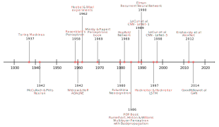

# A Roadmap to Neural Network Models of Cognition

In the introductory chapter, I mentioned connectionist models as one of the main approaches in the computational cognitive modeling landscape. This e-book is precisely about this approach to cognition. In this section, I briefly expand on this perspective and lay out a "roadmap" to what comes next in this series. In particular, this roadmap will help you to understand why I selected these models, why they are important to the field, and how they connect to each other from a historical and technical perspective.

There are multiple ways to characterize neural network models. We will cover all the major architectural design traits of each model, like activations functions and learning procedure, but paying particular attention to what was novel or unique about them at the time they were introduced to the field. Keep in mind this is not a comprehensive review, that is left for each chapter, and some concepts may be obscure at this point. Everything will be explained at length later.

 **Table 1** summarizes the main characteristics that we will reference in this roadmap.
 
 **Note**: "Real-valued" includes "Binary" by definition.

| Model                 | Number of neurons | Number of layers | Type of Inputs | Type of Outputs | Learning procedure | Differentiable | Activation function   | Domain                      |
| --------------------- | ----------------- | ---------------- | -------------- | --------------- | ------------------ | -------------- | --------------------- | :-------------------------- |
| McCulloch-Pitts       | Single neuron     | Single layer     | Binary         | Binary          | None               | No             | Step                  | Logic                       |
| Perceptron            | Multiple neurons  | Single layer     | Real-valued | Binary         | Delta rule     | No             | Linear, Threshold                | Linearly-separable                 |
| Adaline               | Multiple neurons  | Single layer     | Real-valued     | Real-valued      | Gradient-based    | No             | Linear, Threshold                |Linearly-separable                            |
| Multilayer Perceptron | Multiple neurons  | Multiple layers  | Real-valued     | Real-valued      | Backpropagation    | Yes            | Linear and Non-linear |Classification and regression                            |
| Recurrent Neural Network         | Multiple neurons  | Multiple layers  | Real-valued     | Real-valued      | Backpropagation Through Time    | Yes            | Linear and Non-linear | Language, Time-series, Sequence-modeling |
| Convolutional Neural Network | Multiple neurons  | Multiple layers  | Real-valued     | Real-valued      | Backpropagation    | Yes            | Linear and Non-linear | Vision, Video, Time-series, Grid-like data                      |

## The McCulloch-Pitts artificial neuron: single neurons and logic gates

We begin the journey with the McCulloch-Pitts artificial neuron (McCulloch & Pitts, 1943), which is probably the first published neuron-based model of cognition. This model was extremely simple in its architecture, which is perfect as building-block for more complex models: a single neuron, with a single layer, where each input has a single link to the output. Only binary inputs and binary outputs are allowed. No learning algorithm was implemented, which means that the solution has to be figured out by the modeler. As binary systems, the application domain was essentially restricted to logic, although you can easily envision other applications with binary input-output relationships. All things considered, McCulloch and Pitts planted the seeds for the future development of the field.

## The Perceptron: multiple neurons and learning

A single neuron architecture with no learning procedures as the McCulloch-Pitts neuron definitively leaves a lot of space for improvement, considering that the human brain has over 86 billion neurons hierarchically organized into multiple layers of very complex connectivity patterns (Azevedo et al., 2009).

Frank Rosenblatt (1958) introduced the so-called "Perceptron" in 1958. The Perceptron incorporated multiple neurons, with complex connectivity patterns, and the ability to process both binary and real-valued inputs. It was also closely inspired by the scientific knowledge about neuroscience from the time.

Arguably, the most important innovation was the introduction of a **learning procedure**: delta rule learning or "error-corrective learning" (Rosenblatt, 1961). Having a learning procedure completely changes the nature of the system from one based on explicit human design to one based on self-organization principles. This was a big leap forward from the perspective of modeling cognitive systems, which as we know have the capacity to learn via environmental feedback.

## The Adaline: linear functions and gradient based learning

The Perceptron introduced learning into neural networks, yet, the learning procedure wasn't efficient from a computational perspective.  The binary threshold function utilized by the Perceptron function was not differentiable, which restricted the possibility to use optimization techniques to make learning faster and more efficient. Bernard Widrow and Ted Hoff introduced the ADALINE (Adaptive Linear Neuron) architecture in 1960, which wasn't that different from the Perceptron but in one key aspect: the **output function is linear** (instead of a threshold), which means it's differentiable. A differentiable output function allows for training via minimizing some global measure of error, like the Mean Squared Error. Such a minimization process can be done pretty efficiently by using the **chain-rules of calculus**, which significantly improves learning speed. It also served as a proof of concept of the idea of training neural nets with gradient descent rather than simply error-correction. Finally, note that the ADALINE did use a threshold function for classification problems at the end, but such a function does not have any role in the training processes.

## The Multilayer Perceptron: non-linear units and backpropagation

Both the Perceptron and the ADALINE have one major flaw as a model of cognition: they are subject to the so-called **linear separability constraint** (Blair & Homa, 2001). In essence, this means that as linear systems they can only learn linear solutions to problems. The issue is that the most interesting problems in cognitive science require non-linear solutions.  Rumelhart, Hinton, and Williams (1986) introduced the Multilayer Perceptron in 1986, with two major innovations that would overcome many of the Perceptron and ADALINE limitations: **non-linear activation functions** and gradient descent learning, a.k.a., **backpropagation**. True, gradient descent learning wasn't an original idea as others like Widrow and Hoff (1960), Kelley (1960), Bryson (1961), and Werbos (1994) used and/or developed the concept earlier. The key was the combination of non-linear functions, backpropagation, and its application to a series of problems that many in the community thought unsolvable by neural networks in the past.

The Multilayer Perceptron impact was so profound that it started a whole new wave of research of neural networks that would lead to even more impressive advances in later years.

## The Convolutional Neural Network: convolutions, pooling, and images

Vision is among those human capacities that "feel" easy and automatic, but that has proved to be incredibly challenging to tackle from a computational modeling perspective. In principle, Multilayer Perceptrons can be used for vision tasks, yet (as will see later) their architecture does not take advantage of the locality of the spacial information encoded in grid-like structure like images. One of the first complex architectures to introduce a series of innovations facilitating learning in vision tasks was the so-called Neocognitron, introduced by Kunihiko Fukushima (1980) in the early '80s. The key innovations where the ideas of simple and complex cells, also known as convolution and pooling respectively. These two operations were inspired in the findings of Hubel and Wisel (1962) about the mammalian visual cortex. Its combination does allow us to exploit the locality of information in grid-like structure, and to reduce the computational requirements to compute hierarchical representations of visual features. Later, Yann Lecun (1989) would expand on Fukushima's work introducing the **LeNet**,  which on top of the convolution and polling operations, utilized the backpropagation algorithm for training, which wasn't a widely known training technique when Fukushima worked on the Neocognitron. Since then Convolutional neural networks have been very successful in addressing a wide variety of tasks on vision-related problems.

## The Recurrent neural network: recurrences and sequence-modeling

Multilayer Perceptron proved to be able to tackle a wide variety of problems. Yet, in most cases, the sequential nature of the data was ignored or avoided. This means that no reference to past states in the network was added to the architectures, even when past states are critical in many problems like language production, planning, and decision-making. In short, they **lacked memory**. Jeffrey Elman (1990) introduced the idea of adding recurrences in neural network models of language in 1990, this is, "loops" that effectively granted **memory** to networks. This wasn't entirely an original idea since John Hopfield (1982) and Michael I. Jordan (1986) implemented the idea of recurrences before than Elman did. Still, Elman's works had a great impact as it showed how a self-referencing neural network could learn a series of time-dependent properties in language (1990). As the community experimented with Recurrent Networks, they realized that training such networks was hard, in particular, learning long-term dependencies (Bengio et al, 1994). Thus, the next big step came when Hochreiter & Schmidhuber (1997) introduced an architecture capable to address long-term dependencies, the so-called Long Short-Term Memory Unit (LSTM). Since LSTMs, recurrent nets have been used to tackle a wide variety of problems in machine learning and cognitive science.

## References

- Azevedo, F. A., Carvalho, L. R., Grinberg, L. T., Farfel, J. M., Ferretti, R. E., Leite, R. E., Filho, W. J., Lent, R., & Herculano‐Houzel, S. (2009). Equal numbers of neuronal and nonneuronal cells make the human brain an isometrically scaled‐up primate brain. *Journal of Comparative Neurology*, *513*(5), 532–541.

- Bengio, Y., Simard, P., & Frasconi, P. (1994). Learning long-term dependencies with gradient descent is difficult. IEEE Transactions on Neural Networks, 5(2), 157–166

- Blair, M., & Homa, D. (2001). Expanding the search for a linear separability constraint on category learning. *Memory & Cognition*, *29*(8), 1153–1164.

- Bryson, A. E. (1961). A gradient method for optimizing multi-stage allocation processes. Proc. Harvard Univ. Symposium on Digital Computers and Their Applications, 72.

- Elman, J. L. (1990). Finding Structure in Time. Cognitive Science, 14(2), 179–211. https://doi.org/10.1207/s15516709cog1402_1

- Fukushima, K. (1980). Neocognitron: A self-organizing neural network model for a mechanism of pattern recognition unaffected by shift in position. Biological Cybernetics, 36(4), 193–202.

- Hochreiter, S., & Schmidhuber, J. (1997). Long short-term memory. Neural Computation, 9(8), 1735–1780.

- Hopfield, J. J. (1982). Neural networks and physical systems with emergent collective computational abilities. *Proceedings of the National Academy of Sciences*, *79*(8), 2554–2558.

- Hubel, D. H., & Wiesel, T. N. (1962). Receptive fields, binocular interaction and functional architecture in the cat’s visual cortex. The Journal of Physiology, 160(1), 106–154.

- Jordan, M. I. (1986). Serial order: A parallel distributed processing approach, ICS Report 8604. *Institute for Cognitive Science, UCSD, La Jolla*.

- Kelley, H. J. (1960). Gradient theory of optimal flight paths. Ars Journal, 30(10), 947–954.

- McCulloch, W. S., & Pitts, W. (1943). A logical calculus of the ideas immanent in nervous activity. The bulletin of mathematical biophysics, 5(4), 115-133.

- Moravec, H. (1998). When will computer hardware match the human brain? *Journal of Evolution and Technology*, *Vol 1*.

- LeCun, Y., Boser, B., Denker, J. S., Henderson, D., Howard, R. E., Hubbard, W., & Jackel, L. D. (1989). Backpropagation applied to handwritten zip code recognition. Neural Computation, 1(4), 541–551.

- Rosenblatt, F. (1958). The perceptron: a probabilistic model for information storage and organization in the brain. Psychological review, 65(6), 386.

- Rosenblatt, F. (1961). Principles of neurodynamics: Perceptrons and the theory of brain mechanisms. Cornell Aeronautical Lab Inc Buffalo NY.

- Rumelhart, D. E., Hinton, G. E., & Williams, R. J. (1986). Learning Internal Representations by Error Propagation. In Parallel Distributed Processing: Explorations in the Microestructure of Cognition (Vol. 1). MIT Press.

- Werbos, P. J. (1994). The roots of backpropagation: From ordered derivatives to neural networks and political forecasting (Vol. 1). John Wiley & Sons.

- Widrow, B., & Hoff, M. E. (1960). Adaptive switching circuits (No. TR-1553-1). Stanford Univ Ca Stanford Electronics Labs.